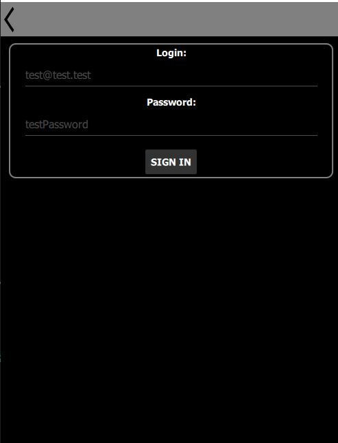
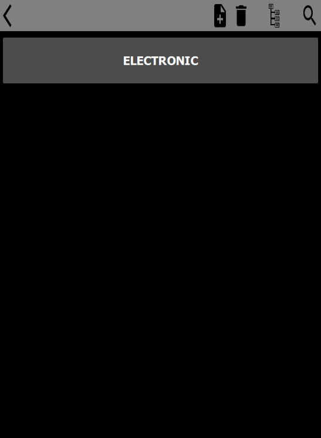

# Daviss App
> Android, Windows and Web application for better management of my life. 

## Table of contents
* [General info](#general-info)
* [Status](#status)
* [Screenshots](#screenshots)
* [Technologies](#technologies)
* [Setup](#setup)
* [Features / TODO](#features--todo)
* [Code Examples](#code-examples)
* [Inspiration](#inspiration)
* [Contact](#contact)

## General info
Main purpose of the project is to implement mobile (so far for android) application. For some cases and easiest compile process it is implemented also for desktop and web solutions.
Application contains few useful modules, which help in daily activities or just are nice addons.

## Status
Project is: **_in progress_** - daily work make progress

## Screenshots
Menu View | Settings View | Depot View
--------- | ------------- | ----------
 |  | 

## Technologies
* Windows 10 x64
* CMake - version 3.20.0
* Git - version 2.30.1.windows.1
* Qt - version 5.15.2 (MSVC 2019, 64-bit)
  - Qt Creator - version 4.14.1
  - MinGW 8.1.0 64-bit
  - Android Clang Multi-Abi (C++, arm, NDK 21.3.6528147)
  - Web Assembly
* Languages:
  - C++
  - QML / JavaScript
  - SQL
  - PHP

## Setup
#### **WEB**
Try application without setup with aid of Web Assembler!

_in progress_

#### **Application .exe**
1. Download build/release.. suitable version
2. Open DavissApp.exe

#### **QT Creator**
1. Download the repository.
2. Open CMakeFiles.txt as new project in QT Creator.
3. Choose compiler - recommended the same as in [Technologies](#technologies).
4. Build and run project.

## Features / TODO
* [x] Login system to web database.
* [ ] Depot system for electronic components, modules, screws etc. available at home stock.  
* [ ] Animeted led matrix module - [project will be available here]()
* [ ] Alarm clock with automated todo activities (eg. make coffee, open blinds) - [project will be available here]()
* [ ] Merge future mobile projects into this application.

## Code Examples
C++:

`C++ CODE`

QML:

`QML CODE`

PHP:

`PHP CODE`

SQL:

`SQL CODE`

## Inspiration
Project inspired by my own private demand - **Application uses in daily life**. 

## Contact
Created by Dawid Uchmanowicz - feel free to contact me!

~<DawidUchmanowicz@gmail.com>
