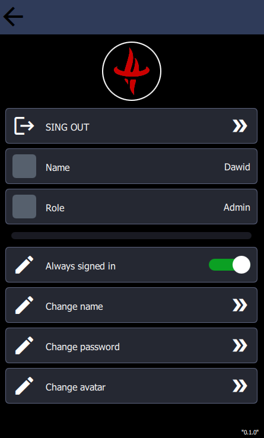

# Daviss App
> Android, Windows and Web application for better daily activities management..

## Table of contents
* [General info](#general-info)
* [Status](#status)
* [Screenshots](#screenshots)
* [Technologies](#technologies)
* [Setup](#setup)
* [Features / TODO](#features--todo)
* [Code Examples](#code-examples)
* [Inspiration](#inspiration)
* [Contact](#contact)

## General info
Main purpose of the project is to implement mobile (so far for android) application. For some cases and easiest compile process it is implemented also for desktop and web solutions.
Application contains few useful modules, which help in daily activities or just are nice addons.

## Status
Project is: **_in progress_** - daily work make progress.

>**Project before first release.**

## Screenshots
Menu View | Settings View | UserInfo View | Depot View
--------- | ------------- | ------------- | ----------
 |  |  | 

## Technologies
* Windows 10 x64
* CMake - version 3.20.0
* Git - version 2.30.1.windows.1
* Qt - version 5.15.2 (MSVC 2019, 64-bit)
  - Qt Creator - version 4.14.1
  - MinGW 8.1.0 64-bit
  - Android Clang Multi-Abi (C++, arm, NDK 21.3.6528147)
  - Web Assembly
* Languages:
  - C++
  - QML / JavaScript
  - SQL
  - PHP
* MVC (Model-View-Controller)
* Hexagonal Architecture

## Setup

#### **Web**
Try application without setup with the aid of Web Assembler!

_in progress_

#### **Application .exe**

_in progress - after first release_

#### **QT Creator**
1. Download the repository.
2. Open CMakeFiles.txt as new project in QT Creator.
3. Choose compiler - recommended the same as in [Technologies](#technologies).
4. Build and run project.

## Features / TODO
* [x] Login system to web database.
* [ ] Sensor's data presenter (eg. data from smog/temperature/humidity/pressure meter). Data collected from web database by web socket notifications.
* [ ] Depot system for electronic components, modules, screws, CNC tools etc. available at home stock.  
  - *[ ] Automatic goods (shapes, colors, barcodes) recognition with the aid of the camera (OpenCV, Machine Learning) - for quick and easy depot's data updating.
* [ ] Interface to Interactive Dynamic LED Matrix Picture (LivingPicture) - [project will be available here]()
* [ ] Interface to All-Purpose Coffee Dispenser - [project will be available here]()
* [ ] Alarm clock with automated TODO morning activities (eg. make coffee, open blinds, prepare sandwich) - [project will be available here]()
* [ ] Merge future mobile projects into this application.

## Code Examples
C++:

`C++ CODE`

QML:

`QML CODE`

PHP:

`PHP CODE`

SQL:

`SQL CODE`

## Inspiration
Project inspired by my own private demand - **Application uses in daily life**. 

## Contact
Created by Dawid Uchmanowicz - feel free to contact me!

~<DawidUchmanowicz@gmail.com>
